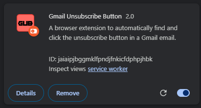
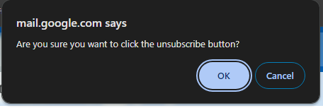

# GmailUnsubscribeButton
A browser extension to automatically find and click the unsubscribe button in a Gmail email.

---

## How To Use
Simply click the GmailUnsubscribeButton extension icon when on a Gmail mail page!

---

## Screenshots

